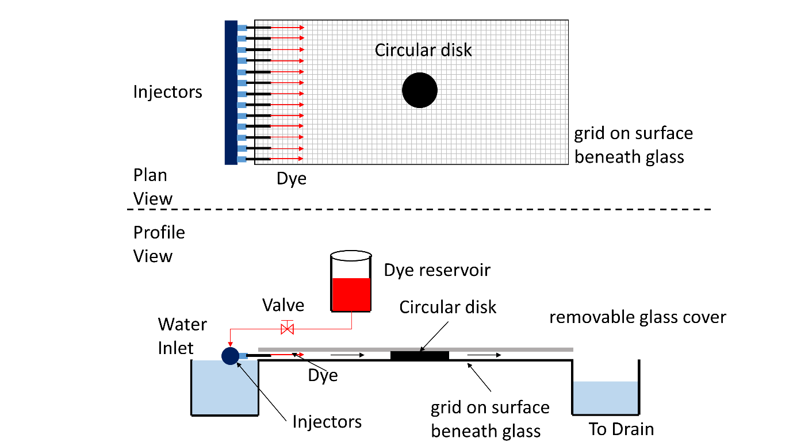
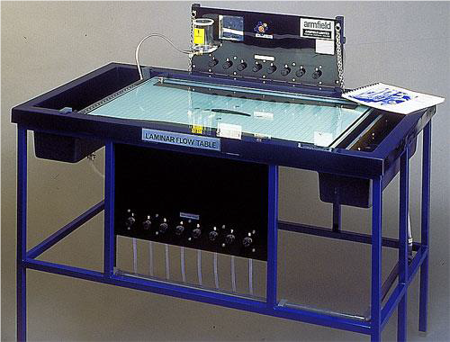

# Theory:

The Laminar Flow Table is an improved version of the classical Hele-Shaw apparatus with the addition of sinks and sources. The Armfield Laminar Flow Table (figure 1 and figure 2) is designed to simulate ideal fluid flow. The table creates two-dimensional laminar flow between two glass plates by the combination of low fluid velocity and the narrow gap between the plates. The resulting flow is free from turbulence and a close approximation to potential flow. Because the flow is driven by a potential field, (i.e. a pressure gradient that exist between two points of interest) the apparatus can be used to model some physical systems that obey Laplace’s equation.

Potential flows are governed by Laplace’s equation [2], which is a linear partial differential equation. It therefore follows that the various fundamental elements’ velocity potential and stream function can be combined to form potentials and stream functions of more complex flow patterns. Thus, we can combine fundamental elements’ velocity potentials or stream functions to yield streamlines that corresponds to flow past a particular body and that combination can be used to describe the details of the flow. This method of solving some interesting flow problems, commonly called the method of superposition.

Figure 1 is a schematic of the laminar flow table used in this experiment. The apparatus consists of a one-piece base made of fiberglass with water reservoirs at each end. Water enters the upstream reservoir and flows over the lower surface of the device to the downstream tank. Water leaves this tank and goes to the drain. A glass cover can be placed over the table and body to model what is referred to as inviscid Hele-Shaw flow behavior. Alternatively, the glass cover is removed to observe the influence of the viscous boundary layer on the flow. The lower
surface is marked with a grid to aid in observation and orientation of the bodies. Mounted at the back of the table is the dye reservoir. A valve at the base of this reservoir controls the flow of the dye, used for visualization of the flow, to the injection needles positioned at the entrance of the table surface.

Apparatus
1.	Laminar flow table [1]
2.	Dye
3.	Models (cylinder and airfoil)

 

#### Figure 1: Schematic diagram of Laminar flow table showing Plan and profile views. The setup is for Hele-Shaw flow past a cylinder

#### Figure 2: Armfield Laminar flow table

 

